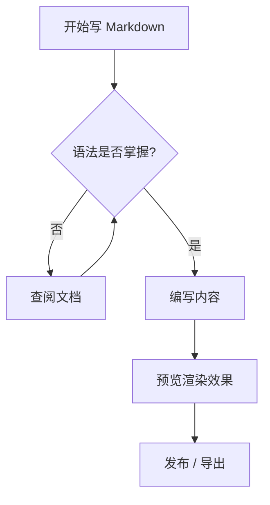

<!--
  本文件为 Markdown 语法示例，覆盖 CommonMark 核心语法及 GFM / 常见扩展语法。
  渲染效果取决于具体引擎（GitHub / Typora / VS Code / Pandoc / KaTeX 等）。
-->

# Markdown 全语法示例文档

> 这是一份用于演示 **Markdown** 各种语法的综合性示例文档，包含从基础到进阶的各类写法。

## 目录

- [标题](#标题)
- [段落与换行](#段落与换行)
- [文本样式](#文本样式)
- [引用块](#引用块)
- [代码](#代码)
- [列表](#列表)
- [分隔线](#分隔线)
- [链接](#链接)
- [图片](#图片)
- [表格](#表格)
- [任务列表](#任务列表)
- [脚注与扩展](#脚注与扩展)
- [HTML 混排与数学公式](#html-混排与数学公式)

---

## 标题

Markdown 支持六级标题，用 `#` 到 `######` 表示。

```text
# 一级标题 H1
## 二级标题 H2
### 三级标题 H3
#### 四级标题 H4
##### 五级标题 H5
###### 六级标题 H6
```

## 段落与换行

这是一个普通段落，由一行或多行文本组成，段落之间用一个或多个空行分隔。

这是另一个段落。  
这一行末尾有两个空格，会产生一个硬换行（`<br>`）。

也可以在行尾使用 HTML 的 `<br>` 标签来强制换行。<br>这是换行后的内容。

## 文本样式

| 样式 | 写法 | 效果 |
|---|---|---|
| 加粗 | `**加粗**` 或 `__加粗__` | **加粗** |
| 斜体 | `*斜体*` 或 `_斜体_` | *斜体* |
| 加粗斜体 | `***加粗斜体***` | ***加粗斜体*** |
| 删除线 | `~~删除线~~` | ~~删除线~~ |
| 行内代码 | `` `code` `` | `code` |
| 下划线 | `<u>下划线</u>` | <u>下划线</u> |
| 高亮 | `<mark>高亮</mark>` | <mark>高亮</mark> |

转义字符示例：需要显示字面符号时用反斜杠转义，如 `\*不是斜体\*`、 `\#不是标题`、 `\`\` 不是代码。

## 引用块

> 这是一个引用块，用于突出引用他人话语或重要说明。
> 多行引用可以在每行前加 `>`，也可以只在第一行加，后续行连续书写。

嵌套引用示例：

> 外层引用
>
> > 内层嵌套引用，层级可继续加深。
> >
> > > 更深一层嵌套引用。

## data

行内代码：`const greeting = "Hello, Markdown!";` 可嵌在段落中。

围栏代码块（指定语言，带语法高亮）：

```javascript
// JavaScript 示例
function greet(name) {
  console.log(`Hello, ${name}!`);
}
greet("Markdown");
```

```python
# Python 示例
def fib(n: int) -> int:
    a, b = 0, 1
    for _ in range(n):
        a, b = b, a + b
    return a

print(fib(10))  # 输出 55
```

```sql
-- SQL 示例
SELECT id, title, created_at
FROM posts
WHERE status = 'published'
ORDER BY created_at DESC
LIMIT 10;
```

不带语言标识的代码块：

```
纯文本代码块 / 无高亮
$ ls -la
$ git status
```

## 列表

### 无序列表

支持 `-`、`*`、`+` 三种符号（可混用，但建议统一）：

- 苹果
- 香蕉
  - 嵌套：苹果香蕉
  - 嵌套：橙子
- 葡萄

### 有序列表

1. 第一步：安装编辑器
2. 第二步：新建 `.md` 文件
3. 第三步：编写内容
   1. 子步骤 A
   2. 子步骤 B
4. 第四步：预览渲染效果

### 嵌套混合列表

- 水果
  1. 苹果
  2. 香蕉
- 蔬菜
  - 西红柿
  - 黄瓜

### 定义列表（扩展语法，部分引擎支持）

<dl>
  <dt>Markdown</dt>
  <dd>一种轻量级标记语言，由 John Gruber 于 2004 年创建。</dd>
  <dt>GFM</dt>
  <dd>GitHub Flavored Markdown，GitHub 对 Markdown 的扩展。</dd>
</dl>

## 分隔线

三种写法（前后需空行）：

---

**********

_______________

## 链接

- 行内链接：[OpenAI](https://openai.com)
- 带标题链接：[百度](https://www.baidu.com "百度一下")
- 相对链接：[返回目录](#目录)
- 自动链接：<https://example.com>
- 邮箱链接：<mailto:hello@example.com>
- 引用式链接：[Google][1] 与 [GitHub][2]

[1]: https://www.google.com
[2]: https://github.com "GitHub"

## 图片

普通图片：


带链接的图片（点击图片跳转）：

[](https://example.com)

HTML 方式可控制图片大小与对齐：

<div align="center">
  
</div>

## 表格

基础表格（默认左对齐）：

| 姓名 | 年龄 | 城市 |
|---|---|---|
| 张三 | 28 | 北京 |
| 李四 | 35 | 上海 |
| 王五 | 22 | 广州 |

指定列对齐方式（左 / 中 / 右）：

| 左对齐 | 居中对齐 | 右对齐 |
|:---|:---:|---:|
| 单元格 A | 单元格 B | 单元格 C |
| 1 | 2 | 3 |

单元格内可包含 **加粗**、*斜体*、`代码` 等行内样式。

## 任务列表

GFM 风格的任务列表（复选框）：

- [x] 安装 Markdown 编辑器
- [x] 学习基础语法
- [ ] 掌握表格与任务列表
- [ ] 发布第一篇文章
- [ ] 学习 MathJax / KaTeX 数学公式

## 脚注与扩展

这里是带脚注的正文[^1]，另一处引用[^note]。

[^1]: 这是脚注 1 的内容，通常渲染在文末。
[^note]: 这是命名为 note 的脚注内容。

扩展语法（视引擎支持情况）：

- 删除线：~~已废弃内容~~
- 下标：`H~2~O` 渲染为 H~2~O
- 上标：`mc^2^` 渲染为 mc^2^

## HTML 混排与数学公式

可在 Markdown 中直接嵌入 HTML 实现更灵活的排版：

<div style="background:#f0f7ff;padding:12px;border-left:4px solid #4a90d9;border-radius:4px;">
  <strong>提示：</strong>这是一个用 HTML 实现的提示框，可自由控制样式。
</div>

<details>
  <summary>点击展开 / 折叠内容（details 标签）</summary>
  <p>这里是被折叠的详细内容，再次点击标题可收起。</p>
</details>

行内数学公式（LaTeX，需 KaTeX / MathJax 支持）：$E = mc^2$，$\sum_{i=1}^{n} i = \frac{n(n+1)}{2}$。

块级数学公式：

$$
\int_{0}^{\infty} e^{-x} \, dx = 1
$$

矩阵示例：

$$
A = \begin{pmatrix}
1 & 2 & 3 \\
4 & 5 & 6 \\
7 & 8 & 9
\end{pmatrix}
$$

---

## Mermaid 图表（部分引擎支持）



---

## Emoji（GFM 支持）

:smile: :heart: :rocket: :tada: :octocat: :cn:

---

*本文档为 Markdown 语法演示，内容仅供测试与学习参考。*
