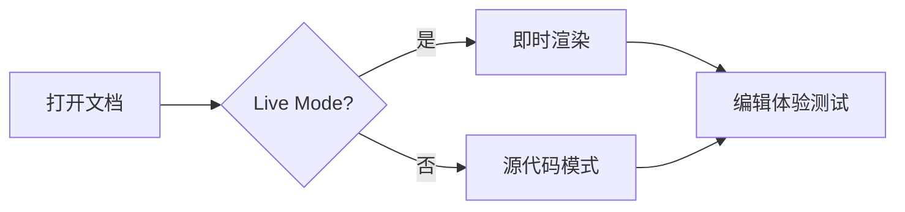
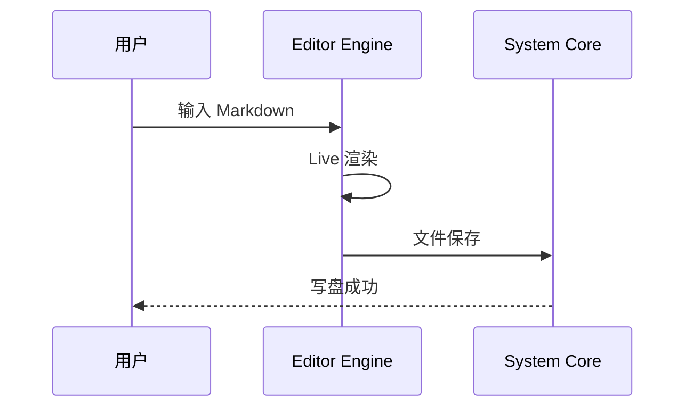
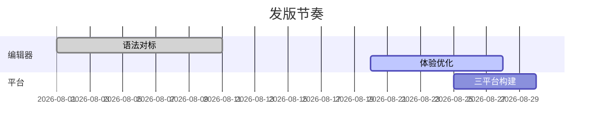

<!-- fixture: full-syntax-corpus.md — 全语法综合渲染测试（CommonMark + GFM + Typora 扩展 + Mellow 引擎特性）。
  所有语法直接渲染（不放代码块展示写法），用于 Live Mode 显示效果与编辑体验测试：
  标题/大纲、行内强调嵌套、列表缩进、表格编辑、代码高亮、链接跳转、图片解析、
  脚注、数学（KaTeX + mhchem）、Mermaid、Alerts、Wikilink、HTML 混排、CJK、转义与边界。 -->

---
title: "Markdown 全语法渲染测试"
description: "覆盖 CommonMark、GFM 与 Typora 扩展语法的综合测试文档"
date: 2026-08-23
tags: [markdown, syntax, fixture, 渲染测试]
lang: zh-CN
---

# Markdown 全语法渲染测试

[TOC]

本文档所有语法**直接渲染**，用于测试 Mellow 的显示效果与编辑体验。可在各章节实际执行编辑操作：标题升降级、列表 Tab/Shift+Tab 缩进、表格行列增删、代码块内输入、公式光标定位等。

## 段落与换行

这是一个普通段落，由一行或多行文本组成，段落之间用一个空行分隔。本段测试**粗体**、*斜体*、`行内代码`、[链接](#段落与换行)在同一段落内的混排与光标穿越。

这一行末尾有两个空格，产生硬换行（`<br/>`）。  
硬换行后的第二行。

也可以用 HTML 标签强制换行。<br>这是换行后的内容。

### 标题层级递进

#### 四级标题 H4

##### 五级标题 H5

###### 六级标题 H6

> Setext 式标题（下划线式）见下方源码区，本节演示 ATX 式 H1–H6 完整链路，供大纲面板树形结构测试。

## 行内强调

**粗体**、*斜体*、***粗斜体***、~~删除线~~、==高亮==、`行内代码`、<u>下划线</u>、H~2~O 下标、X^2^ 上标。

嵌套组合：***粗斜体里的 ~~删除~~***、*斜体里的 `code`*、**粗体里的 [链接](https://example.com)**、~~删除里的 ==高亮==~~。

行内代码含反引号：`` `code` `` 用双反引号包裹。

下标与上标组合：CaCO~3~ 溶于酸生成 CO~2~，质量亏损 E = mc^2^。

## 转义字符

\*不是斜体\*、\#不是标题、\[不是链接\]、\_不是强调\_、\~\~不是删除线\~\~、\|不是表格、\\ 反斜杠本身。

- \- 行首转义的连字符不是列表
- \[ \] 方括号原样显示

## 列表

### 无序列表（三种符号 + 四级嵌套）

- 一级条目
  - 二级条目
    - 三级条目
      - 四级条目（Tab 缩进测试）
  - 回到二级
* 星号开头的列表
+ 加号开头的列表

### 有序列表（起始编号 + 嵌套）

3. 从 3 开始编号
4. 第四项
   1. 嵌套有序
   2. 第二个嵌套项
5. 回到顶层

### 任务列表

- [x] 已完成：保留 MarkEdit CoreEditor
- [ ] 待办：三平台 Runtime Qualification
  - [x] macOS 已通过
  - [ ] Windows 待环境
  - [ ] Linux 待环境
- [ ] 待办：默认简体中文 i18n

### 列表内的块级元素

- 列表项内的段落：

  第二段（缩进两空格对齐）。

  ```
  列表项内的代码块
  ```

- 列表项内的引用：
  > 引用内容

## 引用块

> 单层引用：Markdown 纯文本是唯一真源。

> 多行引用的第二种写法
> 只在首行加 `>`，后续行连续书写。

### 嵌套引用

> 外层引用
>
> > 内层引用
> >
> > > 三层引用

### 引用内的块级元素

> 引用内的**加粗**与 `code`
>
> - 引用内的列表
> - 第二项
>
> ```ts
> const inQuote = true;
> ```

## GitHub Alerts

> [!NOTE]
> 强调用户应关注的信息。

> [!TIP]
> 帮助用户更成功的技巧。

> [!IMPORTANT]
> 用户必须了解的关键信息。

> [!WARNING]
> 需要立即注意的风险操作。

> [!CAUTION]
> 负面后果警告。

## 代码块

### 多语言语法高亮

```ts
// TypeScript
interface Editor {
  readonly mode: 'live' | 'source';
  focus(): void;
}
export function createEditor(name: string): Editor {
  const mode = name.includes('.') ? 'live' : 'source';
  return { mode, focus: () => console.log(`focused: ${name}`) };
}
```

```rust
// Rust
fn main() {
    let scales = vec![1, 5, 10];
    let sum: i32 = scales.iter().sum();
    println!("sum = {}", sum);
}
```

```python
# Python
def fibonacci(n: int) -> list[int]:
    seq, a, b = [], 0, 1
    while len(seq) < n:
        seq.append(a)
        a, b = b, a + b
    return seq
```

```json
{
  "name": "mellow",
  "version": "1.3.2",
  "platforms": ["windows", "macos", "linux"],
  "defaultLocale": "zh-CN"
}
```

```bash
#!/usr/bin/env bash
set -euo pipefail
for platform in windows macos linux; do
  echo "building ${platform}..."
done
```

```go
// Go
package main

import "fmt"

func main() {
    ch := make(chan string, 3)
    go func() { ch <- "done" }()
    fmt.Println(<-ch)
}
```

```sql
-- SQL
SELECT platform, COUNT(*) AS builds
FROM releases
WHERE version = '1.3.2'
GROUP BY platform
ORDER BY builds DESC;
```

### 围栏内含三反引号

````text
外层用四反引号包裹：
```
里面是三反引号代码块
```
````

### 缩进式代码块

    这是四空格缩进的
    缩进式代码块（Indented Code Block）

### 行号测试

```text
第 1 行：偏好设置 → Markdown → 代码块行号开关（默认关）
第 2 行
第 3 行
第 4 行
第 5 行
```

## 表格

### 三种对齐

| 左对齐 | 居中对齐 | 右对齐 |
|:-------|:--------:|-------:|
| default | centered | right |
| **粗体** | *斜体* | `code` |
| [链接](https://example.com) | ~~删除~~ | ==高亮== |

### 行内格式与管道转义

| 功能 | 快捷键（macOS） | 说明 |
|:-----|:----------------|:-----|
| 查找 | ⌘F / F3 | 大小写敏感 Aa、正则 .\* 开关 |
| 替换 | ⌘H | Shift+F3 反向跳转 |
| 转义竖线 | a \| b | 单元格内显示 a \| b |
| CJK 单元格 | 中文内容 | 表格内中文对齐 |

### 宽表（横向滚动测试）

| 列一 | 列二 | 列三 | 列四 | 列五 | 列六 | 列七 | 列八 |
|:-----|:-----|:-----|:-----|:-----|:-----|:-----|:-----|
| 1 | 2 | 3 | 4 | 5 | 6 | 7 | 8 |
| 数据较长的单元格内容 | 数据 | 数据 | 数据 | 数据 | 数据 | 数据 | 数据 |

## 链接

- 行内链接：[Mellow 仓库](https://github.com/jincaiw/Mellow)
- 带标题的链接：[GitHub](https://github.com "GitHub 首页")
- 自动链接：<https://example.com>
- 裸链接（GFM autolink）：https://example.org
- 锚点链接：跳转到[行内强调](#行内强调)章节
- 文件链接：[README](../../README.md) 与[同类语料](mixed-document.md)
- 引用式链接：[引用式链接][ref-link]
- 中文链接目标：[中文锚点测试](#中文锚点测试)

[ref-link]: https://example.com/ref "引用式链接定义"

## 图片

### 本地相对路径（含 ../ 上级目录）


### 带 alt 与 title


### 居中图片（HTML）

<p align="center">
  
</p>

## 分隔线

---

***

___
（上面依次是 `---`、`***`、`___` 三种写法）

## 脚注

这是一个脚注引用[^1]，这是另一个[^note]。

同一段落重复引用同一脚注[^1]。

[^1]: 短脚注定义。

[^note]: 长脚注定义，支持多段内容。

    缩进的第二段：脚注定义内的**格式**与 `code` 均应渲染。

    ```
    脚注内的代码块
    ```

## 数学公式

### 行内公式

质能方程 $E = mc^2$，二次方程求根 $x = \frac{-b \pm \sqrt{b^2 - 4ac}}{2a}$，中文与公式混排：当 $a \ne 0$ 时有解。

### 块级公式

$$
\int_{-\infty}^{\infty} e^{-x^2} \, dx = \sqrt{\pi}
$$

$$
\begin{pmatrix} a & b \\ c & d \end{pmatrix}
\begin{pmatrix} x \\ y \end{pmatrix}
=
\begin{pmatrix} ax + by \\ cx + dy \end{pmatrix}
$$

### mhchem 化学式

$$
\ce{2H2 + O2 -> 2H2O}
$$

$$
\ce{SO4^2-} \quad \ce{CaCO3 ->[\Delta] CaO + CO2 ^}
$$

行内化学式：$\ce{H2O}$ 与 $\ce{CO2}$。

## Mermaid 图表

### 流程图



### 时序图



### 甘特图



## HTML 混排

键盘快捷键：<kbd>Ctrl</kbd> + <kbd>Shift</kbd> + <kbd>L</kbd> 切换侧边栏。

<span style="color: #0969da">彩色文本</span>、<mark>HTML 高亮</mark>、<sub>下标</sub>、<sup>上标</sup>。

<details>
<summary>折叠内容（点击展开）</summary>

折叠区内的 Markdown：**加粗**与列表。

- 列表项一
- 列表项二

</details>

## Emoji 与 Wikilink

原生 Emoji：😄 🎉 🚀 ✅ ⏳ :+1:

Shortcode 形式（若引擎启用自动补全，输入 `:` 应触发候选）：:smile: :tada:

Wikilink：[[mixed-document|综合文档（wikilink 跳转测试）]]

## CJK 混排

中文段落：仓颉输入法下测试 IME 组合窗口与光标跟随，中日韩字符集中的**加粗**、*强调*、~~删除~~ 样式渲染正确性。

日本語の段落：これは日本語のテキストです。**太字**と*イタリック*の混在テスト。

한국어 문단: 이것은 한국어 텍스트입니다. **굵게**와 *기울임* 테스트.

中英混排标点：使用全角标点，English words 与中文之间加空格，数字 123 与符号 —…「」『』（）测试。

## 边界情况

### 超长行（软换行/横向滚动测试）

这一行是一段非常长的中文文本没有任何换行符用于测试编辑器在超长行场景下的软换行渲染与横向滚动行为当行长超过视口宽度时应当正确折行或者滚动而不是破坏行内样式的渲染这一行是一段非常长的中文文本没有任何换行符用于测试编辑器在超长行场景下的软换行渲染与横向滚动行为当行长超过视口宽度时应当正确折行或者滚动而不是破坏行内样式的渲染。

### 连续特殊字符

a*b*c 不是强调（星号紧贴文字）。

** ** 空强调。星号 `*` 与下划线 `_` 连续：\*\*\* 与 \_\_\_。

行首井号加空格是标题，行首井号无空格不是标题：#不是标题。

### 空结构

上面的空段落之间有两个空行，应合并为一个段落间距。

### 混合嵌套压力测试

> 引用内的任务列表：
> - [x] 已完成项
> - [ ] 待办项
>   - 嵌套待办
>
> 引用内的表格：
>
> | A | B |
> |:--|:--|
> | 1 | 2 |

1. 有序列表内的引用：
   > 列表项内的引用块
2. 有序列表内的代码块：

   ```
   列表内代码块
   ```

## 中文锚点测试

本节用于验证中文标题锚点跳转（`#中文锚点测试`）。
