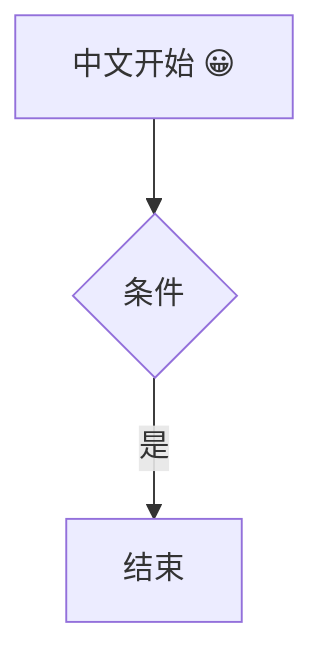
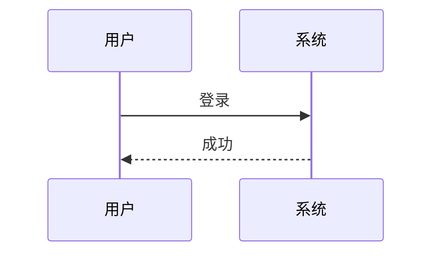
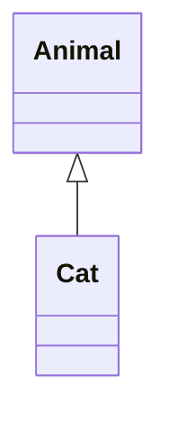
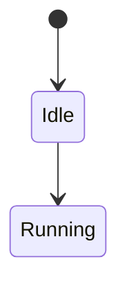
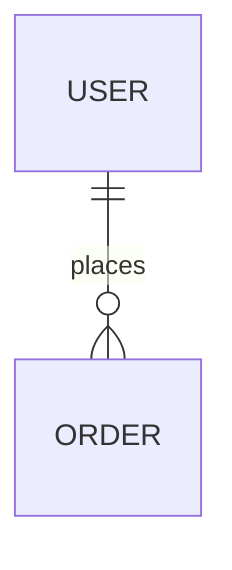
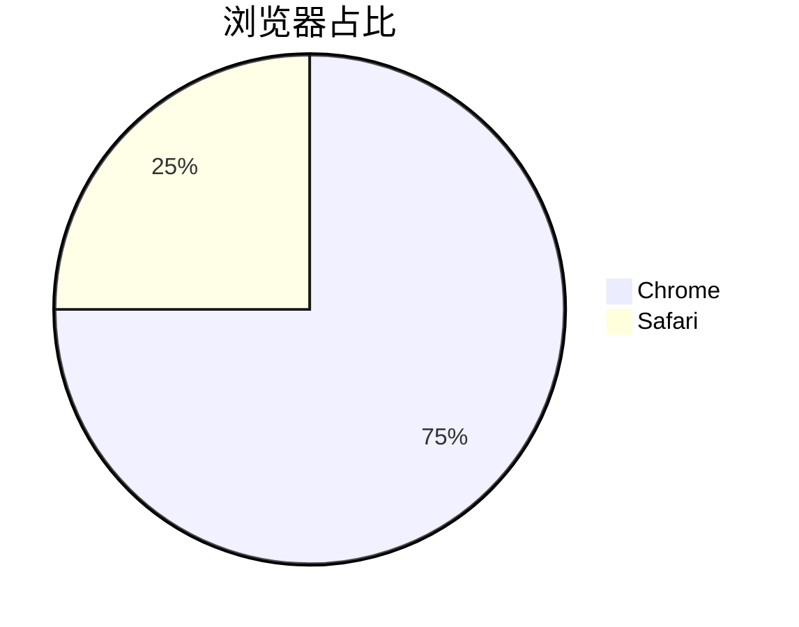
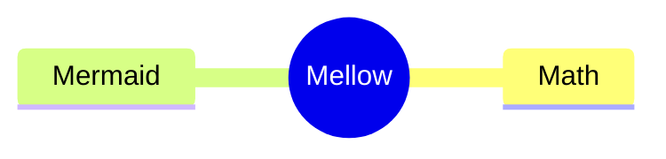
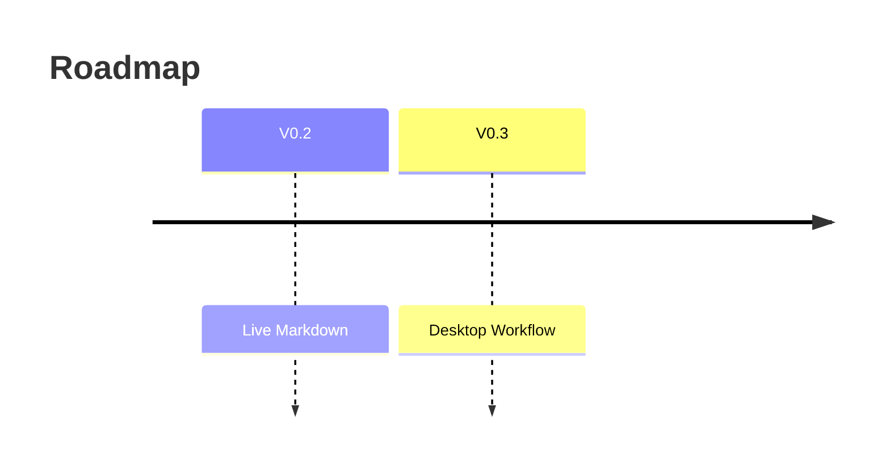

# Typora Mermaid Corpus

```mermaid
flowchart TD
  A[中文开始 😀] --> B{条件}
  B -->|是| C[结束]
```

```mermaid
sequenceDiagram
  participant 用户
  participant 系统
  用户->>系统: 登录
  系统-->>用户: 成功
```

```mermaid
classDiagram
  class Animal
  Animal <|-- Cat
```

```mermaid
stateDiagram-v2
  [*] --> Idle
  Idle --> Running
```

```mermaid
erDiagram
  USER ||--o{ ORDER : places
```

```mermaid
pie title 浏览器占比
  "Chrome" : 60
  "Safari" : 20
```

```mermaid
mindmap
  root((Mellow))
    Math
    Mermaid
```

```mermaid
timeline
  title Roadmap
  V0.2 : Live Markdown
  V0.3 : Desktop Workflow
```

```mermaid
kanban
  todo[Todo]
  done[Done]
```

```mermaid
this is not valid mermaid !!!
```
